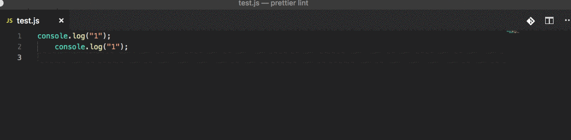

# Setting up VS Code, part 1

In the following document, I'll highlight how to set up Prettier

## Prettier

Prettier is "an opinionated code formatter". Meaning that it formats your code in a specific way. It indents for you, changes " to ' and a lot of other stuff. We could do this ourselves but there are (at least) two reasons for letting Prettier do it for us.

1. It's consistent. It always does stuff the same way, so if you work in a team, you'll have fewer merge conflicts.
2. It's super easy (and it's kind of the industry standard now)

### Install the extension

Open the extension sidebar (Cmd-Shift-X) inside Visual Studio Code and search for Prettier - JavaScript formatter. There are a few extensions with that name so be sure to install the one by Esben Petersen.

### Integrate Prettier

We'll make Prettier do it's thing everytime we save:

1. open "User settings"
   - (Cmd-Shift-p) and search for user settings
2. Add the line: `"editor.formatOnSave": true,` to the user settings on the right
3. Restart the editor and enjoy
   
